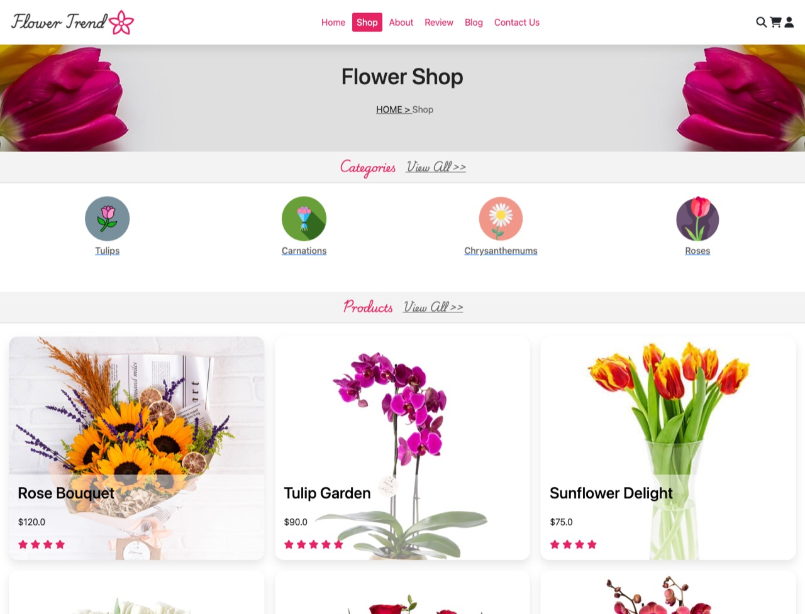
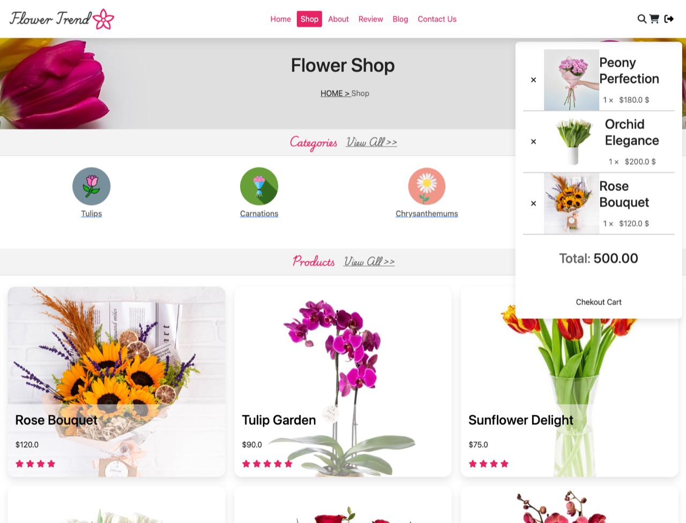
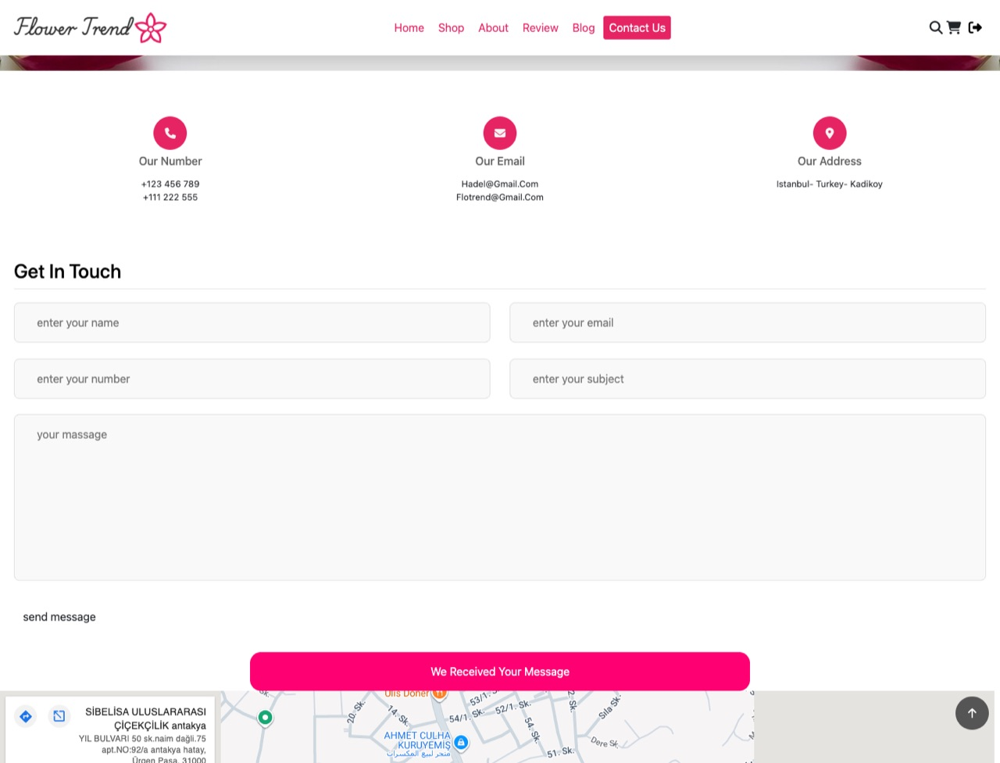

<div align="center">


# Flower Trend

**A server-rendered flower shop built with Node.js, Express, EJS and MongoDB.**

[](https://hadilberavi.github.io/flower-store-/)
[](https://github.com/Hadilberavi/flower-store-/actions/workflows/deploy-demo.yml)


[Features](#features) ·
[Getting started](#getting-started) ·
[About the demo](#about-the-live-demo) ·
[Known limitations](#known-limitations)


</div>

## Overview

Flower Trend is an online flower shop. Visitors browse 13 bouquets, fill a shopping cart once signed in, create an account and send the shop a message. Every page is rendered on the server with EJS templates. Accounts and contact messages are stored in MongoDB through Mongoose, and sessions through connect-mongo.

**Try it without installing anything:** the [live demo](https://hadilberavi.github.io/flower-store/) is a static copy of the app on GitHub Pages. Sign in with `demo@example.com` / `demo1234`, or register your own account.

This is a portfolio project, not a production-ready shop. See [known limitations](#known-limitations) before reusing the code.

<table>
  <tr>
    <td width="50%"></td>
    <td width="50%"></td>
  </tr>
  <tr>
    <td align="center"><sub>Shop: products with prices and ratings</sub></td>
    <td align="center"><sub>Cart: add, remove and total, once signed in</sub></td>
  </tr>
  <tr>
    <td width="50%"></td>
    <td width="50%"></td>
  </tr>
  <tr>
    <td align="center"><sub>About: video and story sections</sub></td>
    <td align="center"><sub>Contact: confirmation after sending</sub></td>
  </tr>
</table>

## Features

### Storefront
- **Home page** with a three-slide Bootstrap carousel and three promotional banners.
- **Shop page** with four category tiles and 13 bouquets. Each bouquet shows a price and a star rating and is rendered from one reusable EJS product card.
- **Shopping cart** in a slide-in panel. Signed-in visitors can add bouquets, remove them and see a running total, and adding the same bouquet twice is caught. The cart lives in the page and is not saved.

### Accounts and sessions
- **Registration** saves users to MongoDB with Mongoose. The schema stores usernames in lowercase and requires a username of ASCII letters and digits, a valid email that is not registered yet, and a password of at least four characters.
- **Login** uses email and password, and the logout button sits in the header. `express-session` and `connect-mongo` keep sessions in MongoDB.
- **Signed-in state** swaps the header's login icon for a logout button, unlocks the cart and shows the username on the home page.

### Contact and content
- **Contact page** with phone, email and address details, an embedded Google Map and a form. The form saves the sender's name, email, phone number and subject to MongoDB and shows a confirmation.
- **About, reviews and blog pages** offer a video with story sections, service highlights with six testimonials, and six blog post cards. Their copy is still placeholder text.

### Interface
- **Responsive layout** with a collapsible mobile menu.
- **Overlays** for search, login and the cart, plus a fixed header and a scroll-to-top button. The search overlay is visual only.
- **Styles** written as SCSS partials with shared variables and mixins, compiled into one stylesheet.

<p align="center">
  
</p>

## Tech stack

| Layer | Technology |
|---|---|
| Server | Node.js (ES modules), Express 4 |
| Views | EJS templates with a shared layout and partials |
| Database | MongoDB with Mongoose 8 (`users` and `contacts` collections) |
| Sessions | `express-session` with `connect-mongo`, stored in MongoDB |
| Validation | Mongoose schema rules and the `validator` package |
| Styling | SCSS compiled with `sass`, Bootstrap 5.1 and Font Awesome 6 from a CDN, Google Fonts |
| Front-end script | Vanilla JavaScript in `public/js/main.js` |
| Demo hosting | GitHub Pages, deployed by GitHub Actions |

## Getting started

### Prerequisites

- Node.js 18 or newer. Node 22 is recommended.
- A MongoDB server, either local or MongoDB Atlas.

### Install and run

```bash
git clone https://github.com/Hadilberavi/flower-store-.git
cd flower-store-
npm install
```

Create a `.env` file in the project root. All four variables are required:

```dotenv
PORT=3000
DB_URI=mongodb://127.0.0.1:27017
SESSION_SECRET=replace-with-a-long-random-string
SESSION_DB_URL=mongodb://127.0.0.1:27017/staj2
```

| Variable | Purpose |
|---|---|
| `PORT` | Port the server listens on. |
| `DB_URI` | MongoDB connection string. The database name is fixed to `staj2` in `server.js`. |
| `SESSION_SECRET` | Secret used to sign the session cookie. |
| `SESSION_DB_URL` | MongoDB connection string where `connect-mongo` stores sessions. |

Start the server:

```bash
node server.js
```

The server connects to MongoDB first and starts listening once the connection succeeds. Then open http://localhost:3000.

To restart automatically when files change, run `node --watch server.js` on Node 18.11 or newer. The `npm run dev` script uses `nodemon`, which is not a project dependency, so install it first with `npm install -g nodemon`.

### Editing styles

The stylesheet is compiled from the SCSS partials in `public/css/`. This command watches `main.scss` and rebuilds `style.css`:

```bash
npm run sass
```

## Routes

| Method | Path | Description |
|---|---|---|
| `GET` | `/` | Home page |
| `GET` | `/shop` | Categories and products |
| `GET` | `/about` | About the shop |
| `GET` | `/review` | Service highlights and testimonials |
| `GET` | `/blog` | Blog posts |
| `GET` | `/contact` | Contact details, form and map |
| `POST` | `/contact` | Save the form, without the message text, and show a confirmation |
| `GET` | `/Register` | Registration form |
| `POST` | `/Register` | Create an account, then show the empty form again. A duplicate email shows "Username already exists" on the home page. |
| `POST` | `/login` | Sign in with email and password. A wrong combination shows "Invalid username or password". |
| `POST` | `/logout` | End the session and return to the home page |

## Data models

**User** (`models/userModel.js`)

| Field | Rules |
|---|---|
| `username` | Required. Stored in lowercase. ASCII letters and digits only. |
| `email` | Required. Must be a valid email. Unique index in MongoDB. |
| `password` | Required. At least 4 characters. |
| `createdAt`, `updatedAt` | Added automatically. |

**Contact** (`models/messagModel.js`): `name`, `email`, `number`, `subject` and `message` as strings, plus `date`, which defaults to now.

## Project structure

```text
flower-store-/
├── server.js                    Express app: sessions, static files, routes, MongoDB connection
├── db.js                        Connection helper, not used by server.js
├── routs/pageRoute.js           Page and form routes
├── controllers/pageController.js  Renders pages; handles register, login, logout and contact
├── models/
│   ├── userModel.js             User schema and validation
│   └── messagModel.js           Contact message schema
├── views/                       EJS templates
│   ├── layout/                  <head> and footer
│   ├── partials/                Header, menu, login form, cart and search overlays
│   ├── components/_shopItem.ejs Product card
│   └── index, shop, about, review, blog, contact, Register (.ejs)
├── public/
│   ├── css/                     SCSS partials compiled to style.css
│   ├── js/main.js               Overlays, cart, mobile menu, scroll-to-top
│   └── images/
├── demo/                        Generated static demo, deployed to GitHub Pages
├── scripts/demo/                Demo generator and the in-browser backend
├── docs/screenshots/            Images used in this README
└── .github/workflows/deploy-demo.yml
```

## About the live demo

GitHub Pages only serves static files, so the [live demo](https://hadilberavi.github.io/flower-store-/) runs the app's backend logic in your browser. Things to know when you try it:

- **Accounts.** Sign in with `demo@example.com` / `demo1234`, or register a new account.
- **Your data.** Accounts and messages stay in your browser's local storage. They never reach a server, and other visitors don't see them. Don't enter a real password. To start over, clear the site data in your browser or run `FlowerDemo.reset()` in the console.
- **Registration errors.** These appear under the form fields. This is demo-only behaviour, because the real app doesn't handle them yet.
- **Links.** Links to `*.html` pages work in the demo, unlike in the Express app.
- **Badge.** A small badge in the corner marks the site as a demo. You can dismiss it.

### How it is built

- **Pages.** `scripts/demo/build.mjs` renders the real EJS views with the same data Express passes. The output is the server's HTML with URLs adjusted for GitHub Pages, plus the demo script and the badge. Some parts depend on state: the login form, the header icon, the username, and the error and confirmation messages. These are written into place for the visitor's current state from the exact template output. During the build, a self-check confirms byte for byte that the demo reproduces every signed-in, signed-out and message state of each page.
- **Behaviour.** `scripts/demo/runtime.js` stands in for the register, login, logout and contact controllers, with the same messages. It applies the same validation rules with the same `validator` library. Like the app's session, its session cookie ends when the browser closes.
- **Assets.** The stylesheet, `main.js` and the images the pages use are copied from `public/` unchanged.

### Updating and deploying the demo

The files in `demo/` are generated, so never edit them by hand. After changing a view, a stylesheet, `main.js` or an image, rebuild the demo and commit the result:

```bash
npm run demo:build
```

To rebuild and preview the demo at http://localhost:4173/flower-store-/, the same sub-path GitHub Pages uses:

```bash
npm run demo:serve
```

Every push to `main` that touches the demo, the views, `public/` or the build scripts runs [`.github/workflows/deploy-demo.yml`](.github/workflows/deploy-demo.yml). The workflow rebuilds the demo, fails if the committed `demo/` is out of date, and publishes it to GitHub Pages. You can also start it by hand from the Actions tab.

To deploy from a fork, first set **Settings → Pages → Source** to **GitHub Actions**. On a free plan, Pages also needs a public repository.

## Known limitations

These are worth addressing before using the app for real:

- **Registration errors.** Invalid data, such as a short password or a username with a space, makes `user.save()` throw an error that nothing catches, which stops the server. After a successful registration, the empty form simply reappears, with no confirmation and no sign-in.
- **Login security.** Passwords are stored and compared in plain text. The login handler passes form fields straight into a MongoDB query, which allows operator injection: a crafted request can sign in as an existing user without the password. Hash the passwords and sanitise the input.
- **Contact message.** The message box has no `name` attribute, so the message text is never saved.
- **Placeholder controls.** These don't do anything yet: search, the newsletter form, "remember me", checkout, the wishlist and quick-view icons, the category tiles, "view all", "read more" and the social links.
- **Broken links.** Links to `*.html` files return 404 in the Express app. These include the logo, the breadcrumbs, the "Shop now" buttons and the footer's quick links.
- **Large images.** The home page loads about 27 MB of full-size photos, and `slide3.jpg` alone is 15 MB.
- **Unused code.** `db.js` and the `morgan` import are unused, and the `mongo`, `nodejs-model` and `connect` packages are never imported. `mongose` is npm's empty security placeholder for a removed typosquat of `mongoose`, so it should be removed.

## Credits

Created by **Hadel Berawi** ([@Hadilberavi](https://github.com/Hadilberavi)).

`package.json` declares the ISC license. No separate LICENSE file is included.
